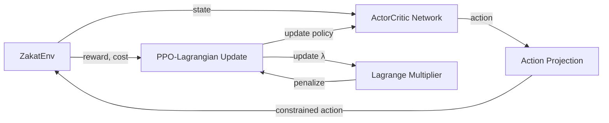

<div align="center">

# HLTF-CMDP

### Hybrid Long-Term Fairness dalam Constrained Reinforcement Learning untuk Distribusi Zakat Dinamis

*Sequential decision-making yang adil dan optimal untuk distribusi zakat di BAZNAS Kota Bandung*

[](https://www.python.org/)
[](LICENSE)
[](#)
[](#)

</div>

---

## 📖 Tentang Proyek

**HLTF (Hybrid Long-Term Fairness)** adalah kerangka kerja yang mengintegrasikan *Reinforcement Learning* ke dalam **Constrained Markov Decision Process (CMDP)** untuk mengoptimalkan distribusi zakat pada 30 kecamatan di Kota Bandung selama periode simulasi 52 minggu per episode.

Proyek ini dikembangkan sebagai bagian dari penelitian skripsi dengan metodologi **Design Science Research (DSR)**, menjawab dua pertanyaan penelitian utama:

- **RQ1** — Bagaimana merancang HLTF-CMDP yang mengintegrasikan *Long-term Benefit Rate (LBR)* sebagai *constraint* eksplisit dalam pengambilan keputusan distribusi zakat?
- **RQ2** — Bagaimana performa HLTF dibandingkan kebijakan distribusi aktual BAZNAS dan RL tanpa *constraint* keadilan (PPO Vanilla)?

Kontribusi utama penelitian ini adalah integrasi LBR (diadaptasi dari ELBERT, Xu dkk. 2022) sebagai *constraint* eksplisit dalam CMDP, dilengkapi *action projection* yang disesuaikan dengan domain distribusi zakat.

---

## ✨ Fitur Utama

- 🎯 **CMDP Formal** — Formulasi lengkap `M = (S, A, P, R, C, γ, δf)` untuk masalah distribusi zakat multi-periode
- ⚖️ **PPO-Lagrangian** — Optimasi kebijakan dengan *adaptive Lagrange multiplier* (λ) untuk menjaga *fairness constraint*
- 🗺️ **Simulasi Realistis** — *Environment* semi-sintetis mencakup 30 kecamatan Kota Bandung, 3 skenario (Normal, Ramadan, Shock)
- 📊 **Evaluasi Komprehensif** — *Benchmark* terhadap kebijakan aktual BAZNAS dan PPO Vanilla, termasuk uji generalisasi *out-of-distribution*
- 🖥️ **Inference UI** — Aplikasi Streamlit untuk simulasi interaktif per periode

---

## 🏗️ Arsitektur Sistem



---

## 📁 Struktur Proyek

```
hltf-cmdp/
├── env/
│   ├── zakat_env.py        # CMDP environment (30 kecamatan, 52 minggu)
│   └── param_builder.py    # Konstruksi parameter skenario
├── agents/
│   ├── network.py          # Arsitektur ActorCritic
│   ├── ppo.py               # PPO baseline (Vanilla)
│   ├── ppo_lagrangian.py    # PPO-Lagrangian (HLTF)
│   └── buffer.py            # Rollout buffer
├── fairness.py               # Perhitungan LBR & Δfair
├── train.py                  # Pipeline training
├── evaluate_hltf.py          # Evaluasi batch full-episode
├── app.py                     # Streamlit inference UI
└── logs/                      # Training & evaluation logs
```

---

## 🚀 Memulai

### Prasyarat

- Python 3.10+
- pip / virtualenv

### Instalasi

```bash
git clone https://github.com/username/hltf-cmdp.git
cd hltf-cmdp
pip install -r requirements.txt
```

### Training

```bash
python train.py --scenario 0 --delta_f 0.008 --eta_lambda 0.5
```

### Evaluasi

```bash
python evaluate_hltf.py --checkpoint checkpoints/hltf_scenario0.pt
```

### Menjalankan Inference UI

```bash
streamlit run app.py
```

---

## 📊 Hasil Eksperimen

| Skenario | Reward | Δ Fair (LBR) | Violation Rate |
|---|---|---|---|
| **Test-split held-out** (n=250) | 0.0867 | 0.0162 | 6.95% |
| **Generalisasi Shock** (n=5) | 0.0357 | 0.0228 | 76.92% |

> Hasil pada *test-split* held-out menunjukkan generalisasi yang baik tanpa *overfitting*. Performa menurun pada skenario Shock yang belum pernah dilihat sebelumnya, menjadi catatan limitasi generalisasi *out-of-distribution* untuk penelitian lanjutan.

**Kalibrasi:** `δf = 0.008`, `η_λ = 0.5` (memenuhi syarat `δf < Δfair_max / 2 ≈ 0.011` agar update λ aktif)

---

## 🔬 Metodologi

Penelitian mengikuti tahapan **Design Science Research (DSR)**:

1. **Problem Identification** — Ketimpangan manfaat jangka panjang dalam distribusi zakat aktual
2. **Objectives Definition** — Merumuskan CMDP dengan *fairness constraint* eksplisit
3. **Design & Development** — Implementasi HLTF-CMDP dan algoritma PPO-Lagrangian
4. **Demonstration** — Simulasi pada data BAZNAS Kota Bandung
5. **Evaluation** — Perbandingan kuantitatif terhadap baseline dan uji generalisasi

---

## 📚 Referensi

- Xu, J., dkk. (2022). *ELBERT: Long-Term Fairness in Reinforcement Learning*.
- Hevner, A. R., dkk. (2004). *Design Science in Information Systems Research*.
- Peffers, K., dkk. (2007). *A Design Science Research Methodology for Information Systems Research*.

---

## 📄 Lisensi

Didistribusikan di bawah lisensi MIT. Lihat `LICENSE` untuk informasi lebih lanjut.

---

<div align="center">

**Dikembangkan sebagai bagian dari penelitian skripsi**
Program Studi Informatika · UIN Sunan Gunung Djati Bandung

</div>
